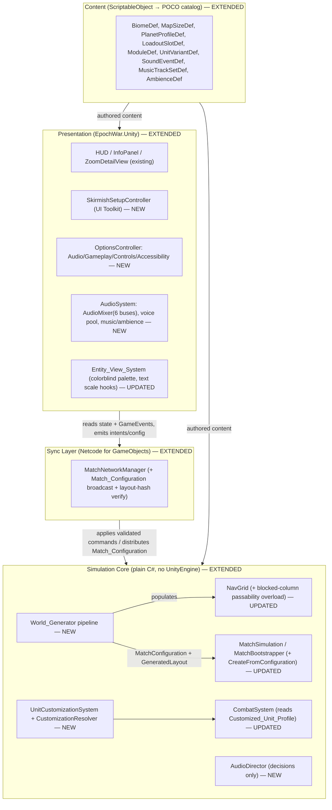
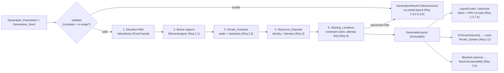
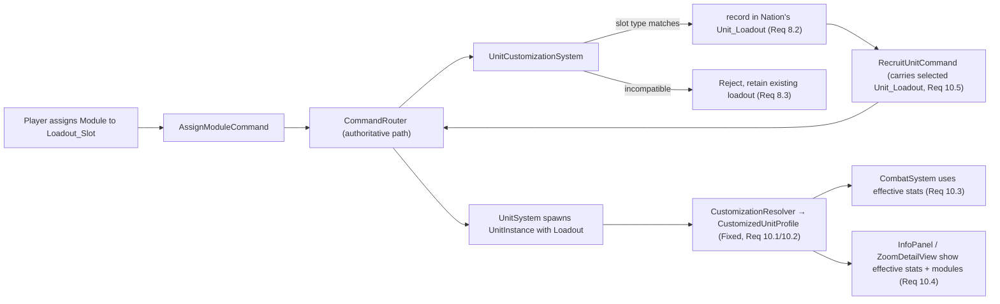
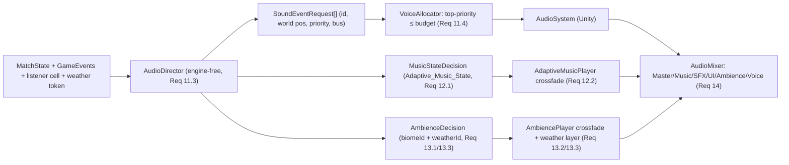

# Design Document — Epoch War: Completion & Expansion

## Overview

This document defines the technical design for the **Completion & Expansion** release — the third, strictly additive specification for the implemented Epoch War codebase. It completes the game across five pillars: **(1) seeded procedural world/planet generation, (2) modifiable/customizable units, (3) rich 3D spatial audio, (4) a full skirmish setup, and (5) a unified options system**, mapping every one of the 20 requirements to concrete components.

Like the `epoch-war-combat-visuals-expansion` before it, this design **extends** the existing types, systems, and fixed-tick loop rather than replacing them. It preserves, without exception, the hard `EpochWar.Core` / `EpochWar.Unity` assembly boundary already enforced by the two prior specs: everything that affects Match state — the `World_Generator`, the `Customized_Unit_Profile` resolver, and the decision layer of the `Audio_Director` — lives entirely in `EpochWar.Core` with **zero `UnityEngine` references**, while the playback `Audio_System`, `Skirmish_Setup` UI, and `Options_System` UI live entirely in `EpochWar.Unity`. All existing base-spec and combat-visuals property tests (base Properties 1–46 and combat-visuals Properties 1–26) remain valid unchanged; new Core fields and systems default to values that reproduce prior behavior.

### Design Principles

1. **Deterministic core, seed-reproducible generation.** The `World_Generator` derives every random choice from a `Generation_Seed` through the existing `DeterministicRandom` (xorshift64\*) and computes every geometric/threshold decision in `Fixed` (Q32.32) — never `float`/`double`, never `System.Random`/`UnityEngine.Random`. Identical `Generation_Seed` + `Generation_Parameters` therefore produce a byte-identical layout on every invocation and on every client (Req 1.2, 1.3, 6.2). The same discipline governs the `Customized_Unit_Profile` resolver (Req 10.2) and the `Audio_Director`'s decisions (Req 11.3).
2. **Extend, don't replace.** New capabilities are added as new POCOs, new catalog content, new command handlers, and new systems composed alongside the existing `MatchSimulation`, `UnitSystem`, `CombatSystem`, `VisionSystem`, `NavGrid`, and `MatchBootstrapper`. No base-spec method signature, command, or event is changed incompatibly; new constructor parameters are optional with behavior-preserving defaults.
3. **The Core/Unity assembly boundary is non-negotiable.** `World_Generator`, `CustomizationResolver`, and `AudioDirector` are engine-free (Req 1.4, 10.2, 11.3). Their outputs are plain data the Unity layer consumes: the generator populates the existing voxel `TerrainVolume` and feeds `NavGrid` passability; the resolver produces a `CustomizedUnitProfile` POCO; the director emits abstract `SoundEventRequest`/music/ambience *decisions* that the Unity `Audio_System` renders.
4. **Content flows through the existing catalog pattern.** Every new content type (Biome, Map_Size, Planet_Profile, Loadout_Slot, Module, Customization_Modifier, Unit_Variant, Sound_Event, music track set, Ambience) is authored as a `ScriptableObject` that converts to an engine-free Core POCO, assembled by `ContentDatabase.BuildCatalog()` into the immutable in-memory catalog — so content authors add content without modifying code (Req 4.4, 5.4, 8.4, 9.1).
5. **Networking shares the seed, not the terrain.** Match-affecting generation is reproduced on every client by distributing the `Match_Configuration` (seed + parameters) through the existing `Network_System`; each client regenerates locally and a layout hash detects divergence. The Host stays authoritative for runtime terrain edits exactly as in the base spec (Req 7).

## Architecture

### Updated Layering



### File-Level Additions by Directory

```
Assets/EpochWar/
  Core/
    Generation/                          # NEW — engine-free World_Generator (Req 1–7)
      WorldGenerator.cs                  # deterministic pipeline entry point
      GenerationParameters.cs            # validated inputs (Map_Size, biomes, symmetry, densities, nation count)
      GenerationSeed.cs                  # seed value + sub-stream derivation
      GeneratedLayout.cs                 # immutable layout POCO (biome map, features, deposits, start locations)
      LayoutCodec.cs                     # canonical byte serialization + FNV-1a layout hash (Req 1.2, 7.4)
      ValueNoise.cs                      # Fixed-point hashed-lattice value/fractal noise (no float)
      BiomeAssigner.cs                   # region → Biome assignment (Req 2.1)
      FeaturePlacer.cs                   # elevation / water / obstacle placement (Req 2.3)
      ResourceDepositPlacer.cs           # deposit placement + density + fairness (Req 3)
      StartingLocationPlacer.cs          # constraint-based placement w/ attempt limit (Req 4)
      SymmetryTransform.cs               # Mirrored/Balanced transforms (Req 4.3)
      GenerationResult.cs                # success(layout) | failure(descriptive error) (Req 1.5, 2.5, 4.5)
    Customization/                       # NEW — engine-free customization (Req 8–10)
      CustomizationResolver.cs           # base UnitDef + modifiers → CustomizedUnitProfile (Fixed)
      LoadoutValidator.cs                # slot/module compatibility (Req 8.2, 8.3)
    Audio/                               # NEW — engine-free decision layer (Req 11–13)
      AudioDirector.cs                   # state+events → sound/music/ambience decisions (Req 11.3)
      MusicStateClassifier.cs            # MatchState → Adaptive_Music_State (Req 12.1)
      VoiceAllocator.cs                  # priority-bounded voice selection (Req 11.4)
      AttenuationCurve.cs                # Fixed distance→volume falloff (Req 11.2)
    State/
      UnitLoadout.cs                     # NEW — slot→module assignment (immutable)
      CustomizedUnitProfile.cs           # NEW — resolved effective attributes
      MatchConfiguration.cs              # NEW — serializable match description (Req 16, 17)
      Nation.cs                          # UPDATED — +TeamId
      UnitInstance.cs                    # UPDATED — +Loadout, +Profile
      Content/
        BiomeDef.cs, MapSizeDef.cs, PlanetProfileDef.cs                 # NEW (Req 2,5,6)
        LoadoutSlotDef.cs, ModuleDef.cs, CustomizationModifier.cs,
        UnitVariantDef.cs                                                # NEW (Req 8,9,10)
        SoundEventDef.cs, MusicTrackSetDef.cs, AmbienceDef.cs,
        VolumeBus.cs, AdaptiveMusicState.cs                              # NEW (Req 11–14)
        UnitDef.cs                        # UPDATED — +LoadoutSlots
        ICatalog.cs / InMemoryCatalog.cs  # UPDATED — new additive catalog interfaces
    Commands/
      AssignModuleCommand.cs             # NEW (Req 8.2, 8.3, 8.5)
      RecruitUnitCommand.cs              # UPDATED — carries optional selected Unit_Loadout (Req 10.5)
    Systems/
      UnitCustomizationSystem.cs         # NEW — per-Nation loadout store + profile resolution (Req 8,10)
      CombatSystem.cs                    # UPDATED — reads Customized_Unit_Profile (Req 10.3)
      VictorySystem.cs                   # UPDATED — enabled-victory filter + team shared victory (Req 17.3, 17.5)
    Navigation/
      NavGrid.cs                         # UPDATED — additive blocked-column overload (Req 2.4)
    Simulation/
      MatchBootstrapper.cs               # UPDATED — CreateFromConfiguration(catalog, MatchConfiguration) (Req 17)
      AiDifficulty.cs                    # NEW — Easy/Normal/Hard behavioral level (Req 16.3)
  Unity/
    UI/
      SkirmishSetupController.cs         # NEW — UI Toolkit skirmish screen (Req 16)
      SkirmishSetupViewModel.cs          # NEW — engine-light validation (Req 16.7)
      OptionsController.cs               # NEW — Audio/Gameplay/Controls/Accessibility (Req 18)
      AudioSettingsViewModel.cs / .Store.cs        # NEW — mirrors GraphicsSettings pattern (Req 15)
      GameplaySettingsViewModel.cs / AccessibilityViewModel.cs         # NEW (Req 18, 20)
      ControlBindingsViewModel.cs / .Store.cs      # NEW — remap + conflict (Req 19)
      InfoPanelViewModel.cs              # UPDATED — effective profile + equipped modules (Req 10.4)
    Audio/
      AudioSystem.cs                     # NEW — mixer routing, playback (Req 11,14)
      AudioSourcePool.cs                 # NEW — voice pool + release (Req 11.5)
      AdaptiveMusicPlayer.cs             # NEW — crossfade state machine (Req 12.2)
      AmbiencePlayer.cs                  # NEW — biome/weather ambience crossfade (Req 13)
    Net/
      MatchNetworkManager.cs             # UPDATED — Match_Configuration broadcast + hash verify (Req 7,17.4)
      NetMatchConfiguration.cs           # NEW — serialized config payload
    Content/
      BiomeAsset.cs, MapSizeAsset.cs, PlanetProfileAsset.cs,
      ModuleAsset.cs, LoadoutSlotAsset.cs, UnitVariantAsset.cs,
      SoundEventAsset.cs, MusicTrackSetAsset.cs, AmbienceAsset.cs        # NEW authoring
      ContentDatabase.cs                 # UPDATED — new asset lists + conversions
      UnitAsset.cs                       # UPDATED — +Loadout_Slots authoring
```

### Deterministic Generation Pipeline

The `World_Generator` is a fixed, ordered pipeline. Each stage draws from a **sub-stream** of `DeterministicRandom` whose seed is derived by mixing the master `Generation_Seed` with a constant stage id (`stageSeed = Mix(seed, stageId)`), so stages are independent yet fully reproducible, and iteration within a stage always visits cells in canonical X-fastest order. No stage uses `float`.



**Noise (float-free).** `ValueNoise` derives a deterministic value at each integer lattice corner by hashing `(stageSeed, latticeX, latticeZ)` with a splitmix-style `unchecked` 64-bit mix, normalizes it into `Fixed [0,1]`, and interpolates between corners with a `Fixed` smoothstep. An elevation field is the amplitude-weighted sum of several octaves, all in `Fixed`, normalized by dividing by total amplitude (`Fixed` division is exact/deterministic). Elevation per column is mapped to an integer cell height in `[0, Map_Size.MaxHeight]`.

**Biomes.** `BiomeAssigner` scatters *N* biome seed points from a sub-stream, assigns each column to its nearest seed point by integer squared distance (deterministic tie-break on column index), and each seed point selects a `BiomeDef` by weighted choice from the parameter's biome set (Req 2.1). Every column thus maps to exactly one Biome.

**Features.** `FeaturePlacer` produces (a) elevation already computed; (b) **water bodies** where elevation lies below the parameter water level; (c) **obstacles** where a separate obstacle-density noise exceeds a threshold on non-water land (Req 2.3). Both water and obstacle columns are recorded in `GeneratedLayout.BlockedColumns`.

**Terrain population & passability.** `GeneratedLayout.ToTerrainVolume()` fills a `TerrainVolume`: each column is solid from `y=0` up to its elevation using the Biome's `CellMaterial` (surface material chosen so the Terrain_Renderer can always resolve a `Cell_Material`, Req 2.2), and empty above. Passability for the `NavGrid` (Req 2.4) is delivered two ways that agree by construction: the blocked columns are passed to a new **additive `NavGrid` overload** that treats them as never-walkable, and obstacle columns are additionally raised as tall solid spires so even the base surface-step rule (`CanTraverse`) rejects them. The existing `Pathfinder` then routes ground units around water and obstacles with no further generation input.

**Ascension planet (Req 6).** A `Planet_Profile` is a content-defined `Generation_Parameters` template; `World_Generator.GeneratePlanet(planetProfile, seed)` runs the identical pipeline, so planet layouts are byte-identical for a given profile+seed (Req 6.2). The planet's seed is derived from the `Match_Configuration` (`planetSeed = Mix(matchSeed, PlanetStageId)`) so every client generates the same planet (Req 6.4).

### Networked Generation Synchronization (Req 7)

```mermaid
sequenceDiagram
  participant Host
  participant NGO as MatchNetworkManager (NGO)
  participant Client
  Host->>NGO: Match begins with Match_Configuration (seed + params)
  NGO-->>Client: broadcast Match_Configuration (Req 7.1, 17.4)
  Note over Host,Client: each side regenerates locally — no streamed terrain (Req 7.2)
  Host->>Host: World_Generator → GeneratedLayout + LayoutHash
  Client->>Client: World_Generator → GeneratedLayout + LayoutHash
  Client->>NGO: report local LayoutHash
  NGO->>Host: compare hashes
  alt hashes match
    Host-->>Client: start Match
  else divergence (Req 7.4)
    Host-->>Client: synchronization error; do NOT start for that client
  end
  Note over Host,Client: runtime terrain edits stay Host-authoritative via existing TerrainDeltaReplicator (Req 7.3)
```

The Host stays authoritative for all subsequent terrain modifications, which continue to replicate through the base spec's `TerrainDeltaReplicator` (Req 7.3). Only the compact `Match_Configuration` crosses the wire for generation, never full terrain (Req 7.2).

### Unit Customization Flow (Req 8–10)



### Audio Decision → Playback Split (Req 11–14)



## Components and Interfaces

### World_Generator (`EpochWar.Core.Generation`) — Requirements 1–7

- **`WorldGenerator.Generate(GenerationParameters parameters, GenerationSeed seed) -> GenerationResult`** — the single entry point. Validates parameters first (Req 1.5), then runs the five ordered stages, returning `GenerationResult.Success(GeneratedLayout)` or `GenerationResult.Failure(string reason)`. Never returns a partial layout. `GeneratePlanet(PlanetProfileDef profile, GenerationSeed seed)` delegates to the same pipeline with the profile's parameters (Req 6.1).
- **`GenerationParameters`** — immutable, validated bundle: `MapSizeDef MapSize`, `IReadOnlyList<BiomeDef> Biomes`, `int NationCount`, `SymmetryMode Symmetry`, `Fixed ResourceDensity`, `Fixed FeatureDensity`, plus tuning (`WaterLevel`, `MaxPlacementAttempts`, `MinStartSeparationCells`, `StartRegionRadius`, per-Resource minimums). `Validate(ICatalog/IWorldGenCatalog) -> (bool, reason)` enforces completeness and ranges (Req 1.5) and that every referenced Biome has a `CellMaterial` mapping (Req 2.5).
- **`GeneratedLayout`** — immutable output: `Int3 Dimensions`, per-column `SurfaceHeight`/`BiomeId`/`Material`/`Passable`, `IReadOnlyList<CellCoord> BlockedColumns`, `IReadOnlyList<ResourceDepositPlacement>`, `IReadOnlyList<StartingLocation>`. Provides `ToTerrainVolume() -> TerrainVolume` (Req 2.2) and `BlockedColumnSet` for the `NavGrid` overload (Req 2.4).
- **`LayoutCodec`** — `Serialize(GeneratedLayout) -> byte[]` in a fixed canonical order and `Hash(GeneratedLayout) -> ulong` (FNV-1a over the serialized bytes). Two invocations with identical seed+params serialize to identical bytes and hashes (Req 1.2, 6.2), which the Network_System compares for divergence (Req 7.4).
- **`BiomeAssigner`, `FeaturePlacer`, `ResourceDepositPlacer`, `StartingLocationPlacer`, `SymmetryTransform`** — the per-stage pure helpers described in Architecture. `StartingLocationPlacer` retries candidate placements up to `MaxPlacementAttempts`, enforcing contiguous passable area for the Nation's footprint (Req 4.2), minimum pairwise separation (Req 4.4), and minimum per-type resources within `StartRegionRadius` (Req 3.4); on exhaustion it signals failure so `WorldGenerator` returns `Failure` (Req 4.5). Under `SymmetryMode.Mirrored`, it places one region and derives the rest via `SymmetryTransform` for the Nation count (Req 4.3); under `Balanced`, it places independently then equalizes per-Nation deposit counts (Req 3.3).
- **`NavGrid` (additive overload)** — new constructor `NavGrid(TerrainVolume volume, int maxStepHeight, IReadOnlyCollection<CellCoord> blockedColumns)` records blocked `(X,Z)` columns and makes `IsWalkable`/`CanTraverse` return false for them; the existing constructor and all base behavior are untouched, so base pathfinding property tests remain valid.

### MatchBootstrapper & MatchConfiguration — Requirements 16, 17

- **`MatchConfiguration`** (engine-free, serializable) — `GenerationSeed Seed`, `GenerationParameters Parameters` (or a selected pre-made map id), `IReadOnlyList<NationConfig> Roster` (id, human/AI, `AiDifficulty`, `TeamId`, optional `UnitVariant` selection), `IReadOnlyDictionary<ResourceType,float> StartingResources`, `Era StartingEra`, `ISet<VictoryPath> EnabledVictories`. `Validate() -> (bool, string unmetConstraint)` enforces ≥2 Nations, ≥1 enabled victory, and all required fields set (Req 16.7, 17.1).
- **`MatchBootstrapper.CreateFromConfiguration(catalog, MatchConfiguration config, SimulationConfig sim = null)`** — new composition entry point: runs `WorldGenerator.Generate` from the config's seed+parameters, builds the `TerrainVolume` and blocked-column `NavGrid` from the resulting `GeneratedLayout`, converts the roster + layout `StartingLocation`s into `NationSeed`s (starting resources, starting Era, human/AI, `TeamId`, starting Units placed at each `Starting_Location`), and delegates to the existing `Create(catalog, terrain, seeds, sim)` (Req 17.2). Because it produces the same `NationSeed`/`TerrainVolume` inputs the base `Create` already consumes, all base bootstrapping behavior is preserved.
- **`VictorySystem` (additive)** — `InitializeMatch`/the evaluator gains an optional `EnabledVictoryPaths` set (default: all three, matching base behavior) so only enabled conditions are evaluated (Req 17.3), and a `TeamId` on `NationSeed`/`Nation` (default: each Nation its own unique team) so a satisfied condition for any member is a shared victory for the team and team members are not valid targets (Req 17.5). Defaults keep base Properties 44–46 unchanged.
- **`AiDifficulty`** enum (`Easy`, `Normal`, `Hard`) selects the behavioral tuning passed to the AI `IAiController` the bootstrapper attaches for each AI Nation (Req 16.3).

### UnitCustomizationSystem, CustomizationResolver, LoadoutValidator — Requirements 8–10

- **`LoadoutValidator.IsCompatible(LoadoutSlotDef slot, ModuleDef module) -> bool`** — pure: a Module fits a Slot iff their `SlotType` matches (Req 8.2, 8.3).
- **`UnitCustomizationSystem`** — owns a durable per-Nation, per-Unit-type loadout store `Dictionary<int, Dictionary<string, UnitLoadout>>`. Registers `AssignModuleCommand`: on a compatible module it records the assignment in that Unit type's `Unit_Loadout` (Req 8.2); on an incompatible module it returns `CommandResult.Reject` and leaves the existing loadout unchanged (Req 8.3); assigning `null` clears the slot (an unassigned slot contributes no modifiers, Req 8.5). Exposes `ResolveProfile(nationId, UnitDef, UnitLoadout) -> CustomizedUnitProfile` (delegating to `CustomizationResolver`) and `ResolveLoadoutForRecruit(...)` implementing variant precedence (Req 9.2, 9.3).
- **`CustomizationResolver.Resolve(UnitDef baseDef, UnitLoadout loadout, IReadOnlyList<CustomizationModifier> extraModifiers) -> CustomizedUnitProfile`** — engine-free, `Fixed`-only. For each of attack, defense, move speed, Sight_Radius: `effective = (base + Σ additive) × Π multiplicative`, summed/multiplied over every equipped Module's `Customization_Modifier`s plus any Nation-specific extras. Because sum and product are commutative in `Fixed` within range, the result is independent of iteration order — hence identical across all clients for the same base+loadout (Req 10.2). An empty loadout yields a profile equal to the base attributes (Req 8.5).
- **`RecruitUnitCommand` (additive)** — carries an optional selected `UnitLoadout`; the `UnitSystem` recruit handler resolves the loadout by precedence — explicit selection, else the Nation's recorded loadout for the type, else the Nation's `Unit_Variant` default, else the base default (empty) — validates it, and spawns the `UnitInstance` with `Loadout` set and `Profile` resolved (Req 9.2, 9.3, 10.5). The command traverses the identical authoritative router path (Req 10.5).
- **`CombatSystem` (additive)** — `ResolveAttack`/`ResolveAreaAttack` read `EffectiveAttack`/`EffectiveDefense` from the attacker/defender `UnitInstance.Profile` when present, falling back to `Def.Attack`/`Def.Defense` when null (Req 10.3). Veterancy/flank/cover from the combat-visuals spec continue to layer on top. When no modules are equipped the profile equals the base, so base Properties 1–46 are unaffected. Effective `Sight_Radius` from the profile feeds `VisionSystem`.
- **UI (Unity)** — `InfoPanelViewModel`/`ZoomDetailView` display the effective attributes from the `CustomizedUnitProfile` and the list of equipped Modules (Req 10.4).

### AudioDirector, VoiceAllocator, AttenuationCurve (`EpochWar.Core.Audio`) — Requirements 11–13

- **`AudioDirector.Decide(MatchState state, IReadOnlyList<GameEvent> events, CellCoord listenerCell, string activeWeatherId) -> AudioDecisions`** — engine-free (Req 11.3). Maps each triggering `GameEvent` (`CombatResolvedEvent`, `TerrainModifiedEvent`, structure-completed, UI action) to a content `SoundEventDef` and emits a `SoundEventRequest` carrying the event's world location, the Sound_Event's `Volume_Bus`, spatialization flag, and priority (Req 11.1). Emits a `MusicStateDecision` (via `MusicStateClassifier`) and an `AmbienceDecision` (predominant Biome around the listener + `activeWeatherId`).
- **`MusicStateClassifier.Classify(MatchState, recentCombatWindow) -> AdaptiveMusicState`** — pure: returns `Battle` when combat activity exists in the recent window, otherwise `PeaceEconomy`, distinguishing at minimum those two states (Req 12.1). When no track set is defined for the classified state, the decision instructs "retain current" so playback is not interrupted (Req 12.4).
- **`VoiceAllocator.Select(IReadOnlyList<SoundEventRequest> requests, int maxVoices) -> IReadOnlyList<SoundEventRequest>`** — pure: returns the highest-priority spatialized requests up to `maxVoices`, suppressing the remaining lower-priority ones (deterministic tie-break), never selecting a lower-priority request over an available higher-priority one (Req 11.4).
- **`AttenuationCurve.VolumeAt(Fixed distance, Fixed maxAudibleDistance, FalloffKind kind) -> Fixed`** — pure `Fixed` falloff: volume is non-increasing in distance and reaches zero at or beyond `maxAudibleDistance` (Req 11.2).
- **`AmbienceSelector`** — predominant Biome around the listener cell from the `GeneratedLayout` biome map drives the `AmbienceDecision`; a Biome with no Ambience yields "no ambience, do not interrupt" (Req 13.4).

### Audio_System, players, pool (`EpochWar.Unity.Audio`) — Requirements 11–14

- **`AudioSystem`** (MonoBehaviour) — subscribes to the drained per-tick `GameEvent`s, invokes `AudioDirector.Decide`, and renders the decisions: routes every clip through the `AudioMixer` on its assigned `Volume_Bus` (Req 14.1, 14.2). Master scales all buses; each non-Master bus is independently adjustable; minimum level silences a bus (Req 14.3–14.5) — implemented against Unity `AudioMixer` exposed parameters (dB conversion).
- **`AudioSourcePool`** — a fixed pool sized to the max concurrent voice budget; plays each `VoiceAllocator`-selected spatialized request as a 3D `AudioSource` at the event's world position (converted from `WorldPosition` at the boundary) with the Sound_Event's distance falloff (Req 11.1, 11.2); on completion the voice is released back to the pool for reuse (Req 11.5).
- **`AdaptiveMusicPlayer`** — a crossfade state machine: on an `Adaptive_Music_State` transition it crossfades from the current track set to the new one over the configured duration (Req 12.2); while unchanged it loops without abrupt restart (Req 12.3).
- **`AmbiencePlayer`** — plays the predominant-Biome Ambience at Match start (Req 13.1), crossfades when the predominant Biome around the listener changes (Req 13.2), and layers/modulates weather audio while the `Atmosphere_System` reports an active weather condition (Req 13.3).

### Skirmish_Setup & Options_System (`EpochWar.Unity.UI`) — Requirements 15, 16, 18–20

- **`SkirmishSetupController` + `SkirmishSetupViewModel`** (UI Toolkit) — lets the Player select an existing map or a generated layout (entering/randomizing a `Generation_Seed` and setting Map_Size, Biome config, Symmetry_Mode, resource density), set Nation count and human/AI assignment, per-AI `AI_Difficulty`, Team assignments, per-victory-condition enable toggles (≥1 required), and starting Resources/Era (Req 16.1–16.6). The engine-light view-model produces a `MatchConfiguration` and validates it; `Start` is blocked with the specific unmet constraint when <2 Nations, no victory enabled, or a required field is unset (Req 16.7). On start it hands the `MatchConfiguration` to `MatchNetworkManager` for distribution (Req 17.4) and to `MatchBootstrapper.CreateFromConfiguration`.
- **`OptionsController`** (UI Toolkit) — a unified menu exposing Audio, Gameplay, Controls, and Accessibility alongside the existing `Graphics_Settings_System` (Req 18.1). Non-restart changes apply immediately (Req 18.2); every change persists (Req 18.3); per-category reset-to-defaults restores and persists that category's defaults (Req 18.4); invalid/unreadable persisted values fall back to defaults with a one-time notice and continue startup (Req 18.5).
- **Audio settings** — `AudioSettingsViewModel` + `AudioSettingsStore` mirror the proven `GraphicsSettingsViewModel`/`GraphicsSettingsStore` pattern (engine-light view-model, JSON DTO with `IsValid`, `TryDeserialize` fallback): every change persists (Req 15.1); persisted levels are applied to the `AudioMixer` before any clip plays at startup (Req 15.2); invalid saved data falls back to defaults with a notice (Req 15.3).
- **`ControlBindingsViewModel` + `ControlBindingsStore`** — presents each remappable `Action` with its current `Control_Binding` (Req 19.1). Assigning an unbound control updates the binding (Req 19.2); assigning a control already bound elsewhere prompts confirmation and, on confirm, moves it (removing it from the previous Action) (Req 19.3); until confirmation both Actions are unchanged (Req 19.4); reset restores default bindings (Req 19.5). Backed by the Unity Input System's runtime rebinding.
- **`AccessibilityViewModel`** — colorblind-safe Nation palette applied across every UI element and `Entity_View_System` representation that conveys Nation identity by color (Req 20.1); UI text scale applied to HUD/info panels/menus without truncation (Req 20.2); hold-vs-toggle input mode makes affected Actions toggle on a single activation (Req 20.3); every value persists (Req 20.4).

## Data Models

```csharp
namespace EpochWar.Core.State.Content
{
    // --- World generation content (Req 2, 5, 6) ---
    public enum SymmetryMode { Mirrored = 0, Balanced = 1 }

    public sealed class BiomeDef
    {
        public string Id { get; }
        public string DisplayName { get; }
        public CellMaterial SurfaceMaterial { get; }        // must resolve a Cell_Material (Req 2.2, 2.5)
        public int SelectionWeight { get; }                 // weighted region assignment (Req 2.1)
        public string AmbienceId { get; }                   // links to AmbienceDef (Req 13.1); may be null (Req 13.4)
    }

    public sealed class MapSizeDef                          // content-catalog entry (Req 5.4)
    {
        public string Id { get; }
        public int Order { get; }                           // ordered set; area non-decreasing (Req 5.3)
        public int Width { get; }                           // in Terrain_Cells (Req 5.2)
        public int Depth { get; }
        public int MaxHeight { get; }
    }

    public sealed class PlanetProfileDef                    // Ascension target template (Req 6.3)
    {
        public string Id { get; }
        public IReadOnlyList<string> BiomeIds { get; }
        public MapSizeDef MapSize { get; }
        public Fixed ResourceDensity { get; }
        public Fixed FeatureDensity { get; }
        public SymmetryMode Symmetry { get; }
    }

    // --- Unit customization content (Req 8, 9, 10) ---
    public enum SlotType { Weapon = 0, Armor = 1, Utility = 2 }
    public enum AttributeTarget { Attack = 0, Defense = 1, MoveSpeed = 2, SightRadius = 3 }
    public enum ModifierOp { Add = 0, Multiply = 1 }

    public readonly struct CustomizationModifier           // Req 10.1
    {
        public AttributeTarget Target { get; }
        public ModifierOp Op { get; }
        public Fixed Value { get; }
    }

    public sealed class LoadoutSlotDef                      // Req 8.1, 8.4
    {
        public string Id { get; }
        public SlotType Type { get; }
    }

    public sealed class ModuleDef                           // Req 8.4
    {
        public string Id { get; }
        public SlotType Type { get; }                       // compatibility key (Req 8.2, 8.3)
        public IReadOnlyList<CustomizationModifier> Modifiers { get; }
    }

    public sealed class UnitVariantDef                      // Req 9.1
    {
        public int NationId { get; }
        public string BaseUnitId { get; }
        public UnitLoadout DefaultLoadout { get; }
        public IReadOnlyList<CustomizationModifier> NationModifiers { get; }
    }

    // --- Audio content (Req 11–14) ---
    public enum VolumeBus { Master = 0, Music = 1, SFX = 2, UI = 3, Ambience = 4, Voice = 5 }
    public enum AdaptiveMusicState { PeaceEconomy = 0, Battle = 1 }
    public enum FalloffKind { Linear = 0, InverseSquare = 1 }

    public sealed class SoundEventDef                       // Req 11.1, 11.2, 11.4, 14.2
    {
        public string Id { get; }
        public VolumeBus Bus { get; }                       // exactly one non-Master bus (Req 14.2)
        public bool Spatialized { get; }
        public Fixed MaxAudibleDistance { get; }            // volume reaches 0 at/beyond (Req 11.2)
        public FalloffKind Falloff { get; }
        public int Priority { get; }                        // higher wins the voice budget (Req 11.4)
    }

    public sealed class MusicTrackSetDef                    // Req 12.2
    {
        public AdaptiveMusicState State { get; }
        public IReadOnlyList<string> TrackIds { get; }
        public Fixed CrossfadeSeconds { get; }
    }

    public sealed class AmbienceDef                         // Req 13
    {
        public string Id { get; }
        public VolumeBus Bus { get; }                       // Ambience bus (Req 14.2)
        public IReadOnlyDictionary<string, string> WeatherLayerByWeatherId { get; } // Req 13.3
        public Fixed CrossfadeSeconds { get; }
    }
}

namespace EpochWar.Core.State
{
    public sealed class UnitLoadout                          // immutable slot→module assignment
    {
        public string UnitId { get; }
        public IReadOnlyDictionary<string, string> ModuleBySlotId { get; } // slotId → moduleId; absent = unassigned (Req 8.5)
        public static UnitLoadout Empty(string unitId) => /* no assignments */;
        public UnitLoadout With(string slotId, string moduleId);           // returns a new loadout
        public UnitLoadout Without(string slotId);
    }

    public sealed class CustomizedUnitProfile               // resolved effective attributes (Req 10.1)
    {
        public int EffectiveAttack { get; }
        public int EffectiveDefense { get; }
        public Fixed EffectiveMoveSpeed { get; }
        public Fixed EffectiveSightRadius { get; }
        public IReadOnlyList<string> EquippedModuleIds { get; }            // for UI (Req 10.4)
    }

    // Nation (additive): + TeamId (default: unique per Nation → base behavior; Req 17.5)
    // UnitInstance (additive): + UnitLoadout Loadout; + CustomizedUnitProfile Profile
    //   (both default null → CombatSystem falls back to base UnitDef stats, preserving Properties 1–46)
    // UnitDef (additive): + IReadOnlyList<LoadoutSlotDef> LoadoutSlots (default empty; Req 8.1)

    public sealed class MatchConfiguration                   // Req 16, 17 — engine-free, serializable
    {
        public GenerationSeed Seed { get; }
        public GenerationParameters Parameters { get; }      // or a selected pre-made map id
        public IReadOnlyList<NationConfig> Roster { get; }
        public IReadOnlyDictionary<ResourceType, float> StartingResources { get; }
        public Era StartingEra { get; }
        public IReadOnlyCollection<VictoryPath> EnabledVictories { get; }
        public (bool ok, string unmetConstraint) Validate(); // ≥2 Nations, ≥1 victory, required set (Req 16.7)
    }

    public sealed class NationConfig
    {
        public int NationId { get; }
        public bool IsAI { get; }
        public AiDifficulty Difficulty { get; }              // meaningful when IsAI (Req 16.3)
        public int TeamId { get; }                           // Req 16.4, 17.5
        public string UnitVariantSetId { get; }              // optional per-Nation variant selection (Req 9)
    }
}

namespace EpochWar.Core.Generation
{
    public readonly struct GenerationSeed { public ulong Value { get; }  /* Mix(seed, stageId) sub-streams */ }

    public sealed class GenerationParameters                 // validated inputs (Req 1.5)
    {
        public MapSizeDef MapSize { get; }
        public IReadOnlyList<BiomeDef> Biomes { get; }
        public int NationCount { get; }
        public SymmetryMode Symmetry { get; }
        public Fixed ResourceDensity { get; }                // Req 3.1
        public Fixed FeatureDensity { get; }                 // Req 2.3
        public Fixed WaterLevel { get; }
        public int MaxPlacementAttempts { get; }             // Req 4.5
        public int MinStartSeparationCells { get; }          // Req 4.4
        public int StartRegionRadius { get; }                // Req 3.3, 3.4
        public IReadOnlyDictionary<ResourceType, int> MinDepositsPerType { get; } // Req 3.4
        public (bool ok, string reason) Validate(IWorldGenCatalog catalog);
    }

    public sealed class GeneratedLayout                      // immutable output (Req 1.1)
    {
        public Int3 Dimensions { get; }
        public int SurfaceHeightAt(int x, int z);
        public string BiomeIdAt(int x, int z);               // exactly one Biome per column (Req 2.1)
        public CellMaterial MaterialAt(int x, int z);        // renderable (Req 2.2)
        public bool IsPassableColumn(int x, int z);          // Req 2.4
        public IReadOnlyList<CellCoord> BlockedColumns { get; }
        public IReadOnlyList<ResourceDepositPlacement> Deposits { get; }   // Req 3
        public IReadOnlyList<StartingLocation> StartingLocations { get; }  // Req 4
        public TerrainVolume ToTerrainVolume();              // Req 2.2
    }

    public readonly struct ResourceDepositPlacement { public ResourceType Type { get; } public CellCoord Cell { get; } public int Amount { get; } }
    public readonly struct StartingLocation { public int NationId { get; } public CellCoord Cell { get; } }

    public readonly struct GenerationResult                  // success | failure (Req 1.5, 2.5, 4.5)
    {
        public bool Succeeded { get; }
        public GeneratedLayout Layout { get; }               // null on failure
        public string FailureReason { get; }                 // null on success
        public static GenerationResult Success(GeneratedLayout layout);
        public static GenerationResult Failure(string reason);
    }
}

namespace EpochWar.Core.Audio
{
    public readonly struct SoundEventRequest
    {
        public string SoundEventId { get; }
        public WorldPosition Position { get; }
        public VolumeBus Bus { get; }
        public bool Spatialized { get; }
        public int Priority { get; }
    }

    public sealed class AudioDecisions
    {
        public IReadOnlyList<SoundEventRequest> Sounds { get; }
        public AdaptiveMusicState MusicState { get; }
        public bool RetainCurrentMusic { get; }              // Req 12.4 (no track set defined)
        public string AmbienceBiomeId { get; }               // null → no ambience (Req 13.4)
        public string ActiveWeatherId { get; }               // Req 13.3
    }
}

namespace EpochWar.Core.Commands
{
    public sealed class AssignModuleCommand : ICommand       // Req 8.2, 8.3, 8.5
    {
        public int IssuingNationId { get; }
        public string UnitId { get; }
        public string SlotId { get; }
        public string ModuleId { get; }                      // null clears the slot (Req 8.5)
    }
    // RecruitUnitCommand (additive): optional UnitLoadout SelectedLoadout carried to the handler (Req 10.5)
}
```

**Additive catalog interfaces.** `ICatalog` is left unchanged. `InMemoryCatalog` additionally implements three new engine-free interfaces — `IWorldGenCatalog` (biomes, map sizes, planet profiles), `ICustomizationCatalog` (loadout slots, modules, variants), and `IAudioCatalog` (sound events, music track sets, ambiences) — and gains optional constructor collections for them. `ContentDatabase` gains the matching authored-asset lists and `ToCore()` conversions. Consumers take only the specific interface they need, so no base-spec catalog consumer is disturbed.


## Correctness Properties

*A property is a characteristic or behavior that should hold true across all valid executions of a system — essentially, a formal statement about what the system should do. Properties serve as the bridge between human-readable specifications and machine-verifiable correctness guarantees.*

Property-based testing applies squarely to this expansion's Match-affecting logic: the `World_Generator`, the `CustomizationResolver`/`UnitCustomizationSystem`, the `AudioDirector`/`VoiceAllocator`/`AttenuationCurve`, and the `MatchConfiguration`/`VictorySystem`/options view-models are all engine-free, deterministic, `Fixed`-based functions over large input spaces. The properties below cover exactly the criteria the prework classified as PROPERTY (and the two EDGE_CASE decisions), after the property-reflection consolidation. Criteria classified INTEGRATION (NGO distribution, Unity `AudioMixer`/`AudioSource` playback, UI presence, persistence I/O, colorblind/text-scale rendering), SMOKE (Core engine-freedom), and EXAMPLE (content-shape facts, view-model recording, parse-fallback cores) are validated by the tests described in the Testing Strategy, not by properties.

### Property 1: Seeded generation is byte-identical and hash-stable (battlefield and planet)

*For any* valid `Generation_Parameters` and `Generation_Seed`, invoking the `World_Generator` two or more times — via either the battlefield entry point or the Ascension-planet entry point with a `Planet_Profile` — produces `GeneratedLayout`s whose `LayoutCodec` serializations are byte-for-byte identical and whose layout hashes are equal; and the planet's derived seed is a pure function of the `Match_Configuration`, so equal configurations yield equal planet layouts.

**Validates: Requirements 1.2, 1.3, 6.2, 6.4, 7.4**

### Property 2: Every valid generation yields a complete, structurally-sound layout

*For any* valid `Generation_Parameters` and `Generation_Seed` (battlefield or planet), the resulting `GeneratedLayout` contains Biome assignments, Terrain_Features, Resource_Deposits, and exactly one Starting_Location per Nation.

**Validates: Requirements 1.1, 6.1**

### Property 3: Biome assignment is total and drawn from the parameter set

*For any* valid generation, every column of the layout is assigned exactly one Biome, and that Biome is a member of the `Generation_Parameters`' Biome set.

**Validates: Requirements 2.1**

### Property 4: Every generated cell has a renderable terrain material

*For any* valid generation, every surface Terrain_Cell of `ToTerrainVolume()` is solid and its `CellMaterial` is a defined material for which the content catalog provides a `Cell_Material` mapping.

**Validates: Requirements 2.2**

### Property 5: Generated features lie within layout bounds

*For any* valid generation, every elevation, water, and obstacle cell (and every blocked column) has coordinates inside the layout's `Dimensions`.

**Validates: Requirements 2.3**

### Property 6: Pathfinding never routes through blocked columns

*For any* valid generation and any pair of walkable start/destination cells, a path returned by the `Pathfinder` over the `NavGrid` built from the layout's blocked-column set contains no water or obstacle (blocked) column.

**Validates: Requirements 2.4**

### Property 7: Resource-deposit count is monotonic in resource density

*For any* fixed seed and parameters differing only in `ResourceDensity` values `d1 <= d2`, the number of Resource_Deposits placed for `d2` is greater than or equal to the number placed for `d1`.

**Validates: Requirements 3.1**

### Property 8: Resource deposits occupy only passable, non-water, non-obstacle cells

*For any* valid generation, every Resource_Deposit is placed on a column that is passable and is neither a water body nor an obstacle (not in the blocked-column set).

**Validates: Requirements 3.2**

### Property 9: Fair symmetry equalizes per-Nation, per-type deposits and mirrors starting regions

*For any* valid generation whose `Symmetry_Mode` designates a fair distribution, each Nation's starting region contains an equal count of Resource_Deposits of each Resource type as every other Nation's; and where the mode is Mirrored, each Nation's starting region is congruent — in terrain, elevation, and Resource_Deposit layout — to every other Nation's under the mirror/rotational transform defined for the Nation count.

**Validates: Requirements 3.3, 4.3**

### Property 10: Every starting region meets the minimum resource guarantee

*For any* successful generation, each Starting_Location has at least the defined minimum count of Resource_Deposits of each required Resource type within the defined starting-region radius.

**Validates: Requirements 3.4**

### Property 11: Starting locations are one-per-Nation, spaced, and on contiguous passable ground

*For any* successful generation, the Starting_Locations number exactly one per Nation in the parameters, every pair is separated by at least the defined minimum starting distance in Terrain_Cells, and each is anchored on a contiguous passable region large enough for that Nation's starting Units and Structures with no overlap of a water body or obstacle.

**Validates: Requirements 4.1, 4.2, 4.4**

### Property 12: Invalid or unsatisfiable generation is rejected without a partial layout

*For any* `Generation_Parameters` that is incomplete, out of the defined valid ranges, references a Biome lacking a `Cell_Material` mapping, or for which Starting_Location placement cannot be satisfied within the defined attempt limit, the `World_Generator` returns a failure carrying a descriptive reason and no (null) generated layout.

**Validates: Requirements 1.5, 2.5, 4.5**

### Property 13: Selected Map_Size determines layout dimensions

*For any* `Map_Size` selected from the catalog, the generated layout's width and depth in Terrain_Cells equal that `Map_Size`'s defined `Width` and `Depth`.

**Validates: Requirements 5.2**

### Property 14: Compatible module assignment is recorded

*For any* Loadout_Slot and Module whose slot types match, applying an `AssignModuleCommand` records the Module in that Unit type's Unit_Loadout for the issuing Nation.

**Validates: Requirements 8.2**

### Property 15: Incompatible module assignment is rejected without state change

*For any* Loadout_Slot and Module whose slot types differ, applying an `AssignModuleCommand` is rejected and the Unit type's existing Unit_Loadout is left unchanged.

**Validates: Requirements 8.3**

### Property 16: Profile resolution folds every modifier over the base, and an empty loadout equals the base

*For any* base `UnitDef` and any Unit_Loadout, the resolved `Customized_Unit_Profile`'s effective attack, defense, movement speed, and Sight_Radius each equal the fold of that attribute's base value with every `Customization_Modifier` contributed by the loadout's equipped Modules; and for an empty loadout (or any unassigned slot), the contribution is nothing, so the effective attributes equal the base attributes exactly.

**Validates: Requirements 8.5, 10.1**

### Property 17: Profile resolution is deterministic and order-independent

*For any* base `UnitDef` and Unit_Loadout, resolving the `Customized_Unit_Profile` yields an identical result regardless of the order in which slots and modifiers are applied, computed entirely in fixed-point — so the resolved profile is identical across all Game_Clients for the same Unit_Loadout and base Unit type.

**Validates: Requirements 10.2**

### Property 18: Combat uses effective profile values rather than base attributes

*For any* attacking and defending Unit whose `Customized_Unit_Profile` differs from its base `UnitDef`, combat resolution computes damage from the effective attack and defense of the `Customized_Unit_Profile`, not from the base attribute values.

**Validates: Requirements 10.3**

### Property 19: Recruit loadout follows the defined precedence through the authoritative pipeline

*For any* recruit of a Unit type, dispatching the `RecruitUnitCommand` through the command router produces a Unit whose Unit_Loadout is resolved by precedence — an explicitly selected loadout if present, otherwise the Nation's recorded loadout for the type, otherwise the Nation's `Unit_Variant` default loadout and Nation-specific modifiers if a variant is defined, otherwise the base Unit type's default (empty) loadout — and the Unit's resolved profile reflects that loadout.

**Validates: Requirements 9.2, 9.3, 10.5**

### Property 20: Spatialized attenuation is monotonic and silent beyond maximum distance

*For any* Sound_Event falloff curve, any maximum audible distance, and any two listener distances `d1 <= d2`, the attenuated volume at `d2` is less than or equal to the volume at `d1`, and the volume at any distance greater than or equal to the maximum audible distance is zero.

**Validates: Requirements 11.2**

### Property 21: Voice budgeting plays the highest-priority sounds up to the limit

*For any* set of requested spatialized Sound_Events and any maximum concurrent voice count, the `VoiceAllocator` selects exactly the highest-priority requests up to that maximum and suppresses the rest, and never suppresses a request while a strictly lower-priority request is selected.

**Validates: Requirements 11.4**

### Property 22: Adaptive music state classification distinguishes battle from peace

*For any* Match state, the `Audio_Director` classifies the `Adaptive_Music_State` as Battle when combat activity exists within the defined recent window and as Peace/Economy otherwise, and the same state always classifies identically.

**Validates: Requirements 11.3, 12.1**

### Property 23: No track set defined leaves the current music uninterrupted

*For any* classified `Adaptive_Music_State` for which no music track set is defined, the `Audio_Director`'s decision retains the current music state and signals no music change.

**Validates: Requirements 12.4**

### Property 24: Ambience follows the predominant biome; absence yields no ambience

*For any* generated layout and listener position, the `Audio_Director` selects as the Ambience the track defined for the predominant Biome around the listener; and when that Biome defines no Ambience track, the decision carries no Ambience and signals no interruption of other audio.

**Validates: Requirements 13.1, 13.4**

### Property 25: Match_Configuration validity is exactly the conjunction of the start constraints

*For any* `Match_Configuration`, it is valid to start if and only if it has at least two Nations, at least one enabled victory condition, and every required field set; otherwise validation fails and reports the specific unmet constraint.

**Validates: Requirements 16.5, 16.7**

### Property 26: Match_Configuration survives a serialization round-trip

*For any* `Match_Configuration`, deserializing its serialized form yields a configuration equal across every field — seed, parameters, Nation roster with human/AI assignment, AI_Difficulty levels, Team assignments, enabled victory conditions, and starting Resources and Era.

**Validates: Requirements 17.1**

### Property 27: Bootstrapping reflects the configuration

*For any* valid `Match_Configuration`, the Match initialized by `MatchBootstrapper.CreateFromConfiguration` contains exactly the configured Nation roster, with each Nation carrying the configured starting Resources, starting Era, and Team assignment.

**Validates: Requirements 17.2**

### Property 28: Only enabled victory conditions are evaluated

*For any* `Match_Configuration` and any Match state, the `Victory_System` ends the Match for a satisfied victory condition if and only if that condition is in the configuration's enabled set; satisfying a disabled condition never ends the Match.

**Validates: Requirements 17.3**

### Property 29: A team victory is shared by all team members

*For any* assignment of Nations to Teams, when any member Nation satisfies an enabled victory condition, every member Nation of that Team is declared a shared victor.

**Validates: Requirements 17.5**

### Property 30: Reset-to-defaults restores exactly the defined defaults for a category

*For any* modified settings category (Gameplay_Settings, Accessibility_Options, or Control_Bindings), applying reset-to-defaults yields exactly the defined default value for every setting in that category, including restoring every Action's default Control_Binding.

**Validates: Requirements 18.4, 19.5**

### Property 31: Rebinding an unbound control updates only that Action

*For any* Control_Binding map and any input control not already bound to another Action, assigning that control to an Action updates that Action's Control_Binding and leaves every other Action's binding unchanged.

**Validates: Requirements 19.2**

### Property 32: Conflicting rebinds move the control on confirm and change nothing until then

*For any* assignment of an input control already bound to a different Action, the previously bound Action and the selected Action both remain unchanged until the reassignment is confirmed; and upon confirmation the control is removed from the previously bound Action and assigned to the selected Action.

**Validates: Requirements 19.3, 19.4**

### Property 33: Toggle input mode toggles on a single activation

*For any* Action affected by the hold-versus-toggle mode set to toggle, a single input activation toggles the Action's active state and a subsequent single activation toggles it back, whereas in hold mode the Action is active only while the input control is held.

**Validates: Requirements 20.3**

## Error Handling

This section extends the base and combat-visuals error-handling lists (command rejection as a first-class `CommandResult`, invariant guards via property tests, network resilience, terrain edge safety, deterministic RNG, settings-store fallback) with the failure modes this expansion introduces:

- **Invalid or unsatisfiable generation parameters.** `WorldGenerator.Generate`/`GeneratePlanet` validate before generating and return `GenerationResult.Failure(reason)` — never a partial `GeneratedLayout` — for incomplete or out-of-range parameters (Req 1.5), a Biome lacking a `Cell_Material` mapping (Req 2.5), or Starting_Location placement that cannot be satisfied within `MaxPlacementAttempts` (Req 4.5). Callers (bootstrapper, network path) treat a failure as an aborted Match setup with the reason surfaced to the UI.
- **Layout divergence across clients.** After distributing the `Match_Configuration`, `MatchNetworkManager` compares each client's locally computed `LayoutCodec` hash against the Host's; a mismatch reports a synchronization error and does not start the Match for that client (Req 7.4). Because generation is deterministic (Property 1), a mismatch indicates a version/content skew, not a transient fault.
- **Incompatible module assignment.** `UnitCustomizationSystem`'s `AssignModuleCommand` handler returns `CommandResult.Reject` with a slot/module-type-mismatch reason and leaves the existing Unit_Loadout unchanged (Req 8.3); an unknown slot or module id is likewise rejected with a distinct reason.
- **Invalid Match_Configuration at start.** `MatchConfiguration.Validate` blocks starting a Match with fewer than two Nations, no enabled victory condition, or an unset required field, returning the specific unmet constraint for the Skirmish_Setup to display (Req 16.7); the bootstrapper never runs on an invalid configuration.
- **Invalid or unreadable persisted settings.** `AudioSettingsStore`, `GameplaySettings`/`AccessibilityOptions` stores, and `ControlBindingsStore` follow the proven `GraphicsSettingsStore` pattern: on a missing file they apply first-launch defaults with no notice; on unreadable/malformed/out-of-range data they apply the defined defaults (per affected setting), display a one-time reset notice, and continue startup rather than throwing (Req 15.3, 18.5).
- **Missing audio content.** A classified `Adaptive_Music_State` with no defined track set leaves the current music playing uninterrupted (Req 12.4); a Biome with no defined Ambience plays no Ambience and does not interrupt other audio (Req 13.4); these are represented as explicit "retain/none" decisions from the `Audio_Director` rather than error states.
- **Keybind conflicts.** A rebind to an already-bound control is not applied until the Player confirms; until then both Actions are unchanged, preventing accidental loss of a binding (Req 19.3, 19.4).

## Testing Strategy

**Dual approach.** Unit/example tests cover specific scenarios, content-shape facts, and edge cases; property tests (FsCheck) cover the universal properties above; PlayMode/integration tests cover Unity-side rendering, audio playback, networking, and persistence I/O. Together they give comprehensive coverage without over-testing narrow logic.

**EditMode + FsCheck property tests (>= 100 iterations each).** Every Correctness Property (Properties 1–33) is implemented as a single property-based test executed entirely against `EpochWar.Core` — `WorldGenerator` and its stage helpers, `LayoutCodec`, `NavGrid`+`Pathfinder` over generated layouts, `CustomizationResolver`/`UnitCustomizationSystem`, `CombatSystem`'s effective-stat path, `AudioDirector`/`VoiceAllocator`/`AttenuationCurve`/`MusicStateClassifier`/`AmbienceSelector`, `MatchConfiguration`, `VictorySystem`'s enabled/team logic, and the engine-light options/binding view-models — with no Unity Play loop, following the pattern the two prior specs established. Each test is tagged `Feature: epoch-war-completion-expansion, Property N: <property text>`. Generators produce valid and boundary `Generation_Parameters`, loadouts spanning empty/partial/full slots, sound-request sets spanning the voice budget, and configurations spanning valid/invalid start constraints.

**EditMode example/unit tests.** Cover the EXAMPLE-classified criteria and property boundaries: content-catalog conversions and lookups for Map_Size/Planet_Profile/Biome/Module/Loadout_Slot/Unit_Variant/Sound_Event/music/ambience assets (Req 5.4, 6.3, 8.1, 8.4, 9.1, 14.2), Map_Size ordered-area monotonicity (Req 5.3), the settings-store `TryDeserialize` fallback cores (Req 15.3, 18.5), the Skirmish view-model recording of nation count/AI difficulty/teams/starting resources (Req 16.2–16.4, 16.6), the `InfoPanel` view-model's effective-stat and equipped-module content (Req 10.4), and boundary cases such as a starting region exactly at the minimum resource count and starts exactly at the minimum separation.

**PlayMode/integration tests and manual verification.** Cover all INTEGRATION-classified criteria — Netcode-for-GameObjects `Match_Configuration` distribution and identical-bootstrap verification and the layout-hash divergence handshake (Req 7.1, 7.2, 7.3, 17.4); Unity `AudioMixer` bus routing/independent adjustment/Master scaling/mute (Req 14.1, 14.3–14.5); 3D `AudioSource` playback, voice release/reuse, adaptive-music crossfade, and biome/weather ambience crossfade timing (Req 11.1, 11.5, 12.2, 12.3, 13.2, 13.3); audio/gameplay/accessibility/control persistence and startup-order application (Req 15.1, 15.2, 18.1–18.3, 20.4); and colorblind-palette and UI-text-scale rendering across the HUD, info panels, menus, and `Entity_View_System` (Req 20.1, 20.2). Engine-freedom of the new Core namespaces (Req 1.4, 10.2, 11.3) is enforced by the `EpochWar.Core.asmdef` carrying no `UnityEngine` reference and the FsCheck suite compiling and running headless.

**Regression guard.** All existing base-spec property tests (Properties 1–46) and combat-visuals property tests (Properties 1–26) continue to run unmodified. New Core fields (`UnitInstance.Loadout`/`Profile`, `Nation.TeamId`, `UnitDef.LoadoutSlots`) and new optional constructor parameters default to values that reproduce prior behavior — a null profile makes `CombatSystem` use base stats, unique per-Nation team ids reproduce the base victory semantics, and the additive `NavGrid` overload leaves the existing constructor untouched — so this expansion introduces no behavioral regression.
